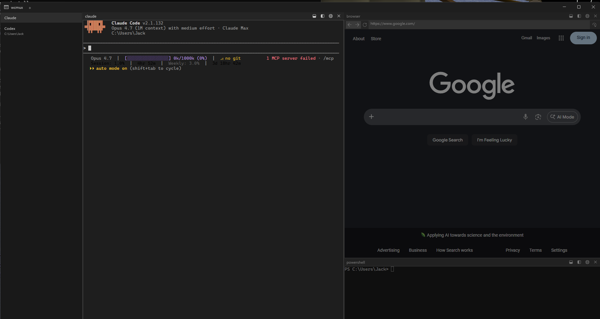

# wcmux

A Windows-first terminal multiplexer for local AI coding workflows. Real ConPTY-backed Windows terminal sessions hosted in a polished WinUI 3 shell — vertical tab sidebar, splittable panes, per-pane title bars with live process names, browser panes, and Windows attention notifications. No web wrapper, no opinionated agent shell.



## Why

Windows users running AI coding tools (Claude Code, Codex, etc.) want tmux-style pane and tab management without giving up native terminal fidelity or being pushed into a vendor-specific UX. wcmux hosts the real Windows console — full TUIs like vim and fzf work — inside a native dark UI with the multiplexer ergonomics you'd expect.

## Features

- **Real ConPTY terminals** — full TUI fidelity (vim, fzf, ncurses apps)
- **Tabs + splittable panes** — horizontal/vertical splits, keyboard focus, drag-to-resize, keyboard swap
- **Vertical tab sidebar** — tab title, current working directory, attention indicators
- **Per-pane title bars** — live foreground process name, inline split/close/browser actions
- **Browser panes** — embed a WebView2 browser alongside terminals (shared CoreWebView2Environment, single process group)
- **Attention notifications** — Windows toast when a background pane rings the bell
- **Custom dark chrome** — replaces default Windows title bar, draggable via `InputNonClientPointerSource`

## Stack

WinUI 3 / Windows App SDK · .NET 9 · ConPTY (kernel32 P/Invoke) · WebView2 · xterm.js 5.5.0 · xUnit (~190 tests)

Architecture is a store pattern (`LayoutStore`, `TabStore`, `AttentionStore`) over an event-driven session bus, with pure reducer functions for layout transitions.

## Hotkeys

### Tabs

| Action | Shortcut |
|---|---|
| New tab | `Ctrl+Shift+T` |
| Next tab | `Ctrl+Tab` |
| Previous tab | `Ctrl+Shift+Tab` |
| Switch to tab 1–8 | `Ctrl+1` … `Ctrl+8` |
| Switch to last tab | `Ctrl+9` |

### Panes

| Action | Shortcut |
|---|---|
| Split horizontal | `Ctrl+Shift+H` |
| Split vertical | `Ctrl+Shift+V` |
| Close pane | `Ctrl+Shift+W` |
| Focus left / right / up / down | `Ctrl+Shift+←/→/↑/↓` |
| Resize left / right / up / down | `Ctrl+Alt+←/→/↑/↓` |
| Swap pane left / right / up / down | `Ctrl+Alt+Shift+←/→/↑/↓` |

## Install

Download the latest `wcmux-setup.exe` from the [Releases](../../releases) page and run it. The installer is self-contained — no separate Windows App SDK install needed.

## Build from source

Requires Visual Studio 2022 with the Windows App SDK workload, .NET 9 SDK, and Windows 10/11 x64.

```powershell
dotnet build src/Wcmux.App/Wcmux.App.csproj -c Release
dotnet run --project src/Wcmux.App/Wcmux.App.csproj
```

### Publish a self-contained build

```powershell
dotnet publish src/Wcmux.App/Wcmux.App.csproj -c Release -r win-x64 --self-contained -o publish
```

The csproj sets `WindowsAppSDKSelfContained=true` and copies compiled XAML (`.xbf`) into the publish output so the published `Wcmux.App.exe` runs without an installed Windows App SDK runtime.

## Status

v1.1 shipped 2026-03-14. Active candidates for v2.0:
- Save and restore named tab/pane layouts across launches
- Local CLI / automation API for driving sessions and layouts from external scripts

## License

MIT
